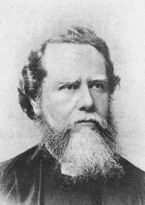

# <!--fit--> A Missional Community  

Self-giving Love: the Book of Philippians - Chapter 7

Timothy Shan

---

# <!--fit--> Mission Bay and Mission Valley 

- Named after California’s first Spanish mission, `San Diego de Alcalá`
    - Mission Valley is a shopping center  
    - Mission Bay is a recreational park by the beach 


--- 

# James Hudson Taylor

<style scoped>
section {
  font-size: 35px;
}
</style>

- `No other missionary in the nineteen centuries since the Apostle Paul has had a wider vision and has carried out a more systematized plan of evangelizing a broad geographical area than Hudson Taylor.`

- If I had a thousand pounds China should have it—if I had a thousand lives, China should have them. No! Not China, but Christ. Can we do too much for Him? Can we do enough for such a precious Saviour?

- God's work done in God's way will never lack God's supply.

---

# James Hudson Taylor 

[](https://youtu.be/QoYPKJjo4cE)

- *please turn on the audio sharing*

--- 

# <!--fit--> Philippians 2: Imitating Christ’s Humility 

> 2 Therefore if you have any encouragement from being united with Christ, if any comfort from his love, if any common sharing in the Spirit, if any tenderness and compassion, 2 then make my joy complete by being like-minded, having the same love, being one in spirit and of one mind. 3 Do nothing out of selfish ambition or vain conceit. Rather, in humility value others above yourselves, 4 not looking to your own interests but each of you to the interests of the others.

--- 

# Discussion  

- Is it true that `If God owns our wallets, our checkbooks, and our credit cards, he has us?`

- Do you have any fears or hesitations about getting more involved in Christian giving? 
    - If so, what are they?

--- 

# <!--fit--> Philippians 4: Final Exhortations 

> 4 Rejoice in the Lord always. I will say it again: Rejoice! 5 Let your gentleness be evident to all. The Lord is near. 6 Do not be anxious about anything, but in every situation, by prayer and petition, with thanksgiving, present your requests to God. 7 And the peace of God, which transcends all understanding, will guard your hearts and your minds in Christ Jesus.

--- 

# <!--fit--> Philippians 4: Final Exhortations 

> 8 Finally, brothers and sisters, whatever is true, whatever is noble, whatever is right, whatever is pure, whatever is lovely, whatever is admirable—if anything is excellent or praiseworthy—think about such things. 9 Whatever you have learned or received or heard from me, or seen in me—put it into practice. And the God of peace will be with you.

--- 

# Discussion  

- Can you think of some widely held values of your own culture that are compatible with the gospel of Christ crucified? 

- What about specific cultural values that the gospel calls into question? 

--- 

# <!--fit--> Colossians 4: Further Instructions

> 2 Devote yourselves to prayer, being watchful and thankful. 3 And pray for us, too, that God may open a door for our message, so that we may proclaim the mystery of Christ, for which I am in chains. 4 Pray that I may proclaim it clearly, as I should. 5 Be wise in the way you act toward outsiders; make the most of every opportunity. 6 Let your conversation be always full of grace, seasoned with salt, so that you may know how to answer everyone.

--- 

# <!--fit--> 1 Peter 3: Suffering for Doing Good

> 13 Who is going to harm you if you are eager to do good? 14 But even if you should suffer for what is right, you are blessed. “Do not fear their threats; do not be frightened.” 15 But in your hearts revere Christ as Lord. Always be prepared to give an answer to everyone who asks you to give the reason for the hope that you have. But do this with gentleness and respect, 16 keeping a clear conscience, so that those who speak maliciously against your good behavior in Christ may be ashamed of their slander.

--- 

# Application  

<style scoped>
section {
  font-size: 35px;
}
</style>

- Can you think of some specific arenas of life in which your actions and attitudes might make the good news attractive to outsiders today? 
    - The Jesus Storybook Bible - Sally Lloyd-Jones
    - The Complete NIV Audio Bible: Read by David Suchet
    - Free piano lessons for hymns 

- But what if people still don't care, or even become hostile?

- The author talks about his father's `Coffee Shop Mission`. Where is your mission field?

--- 

<style scoped>
section {
  color: white;
}
</style>

# <!--fit--> A poem about Mission Bay

```
Fair Mission bay,
Now blue, now gray,
Now flushed by sunset’s after glow,
Thy rose hues take the tint of fawn
At dawn of dusk and dusk of dawn.
God’s placid mirror. Heaven crowned,
Framed in the brown hills circling round,

This thy grand mission, Mission Bay –
To smile serene through blue or gray;
To take whatever God has sent,
And teach mankind a full content.
```


 
