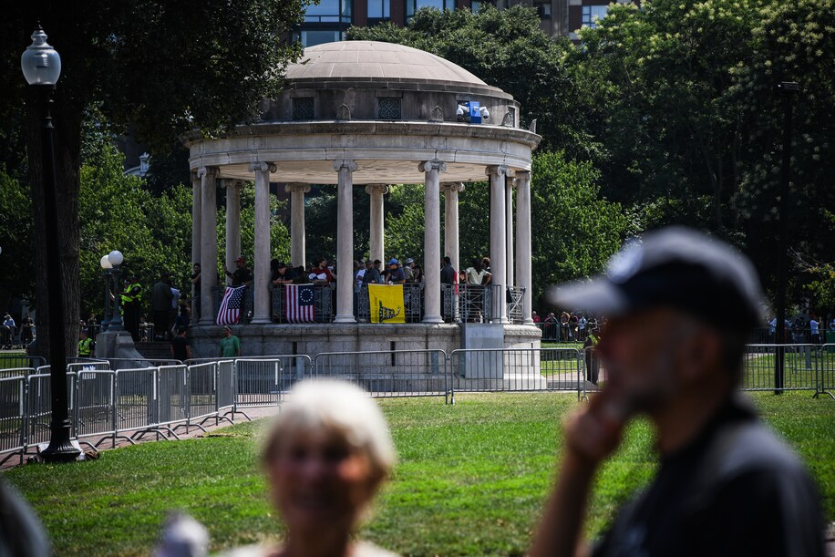
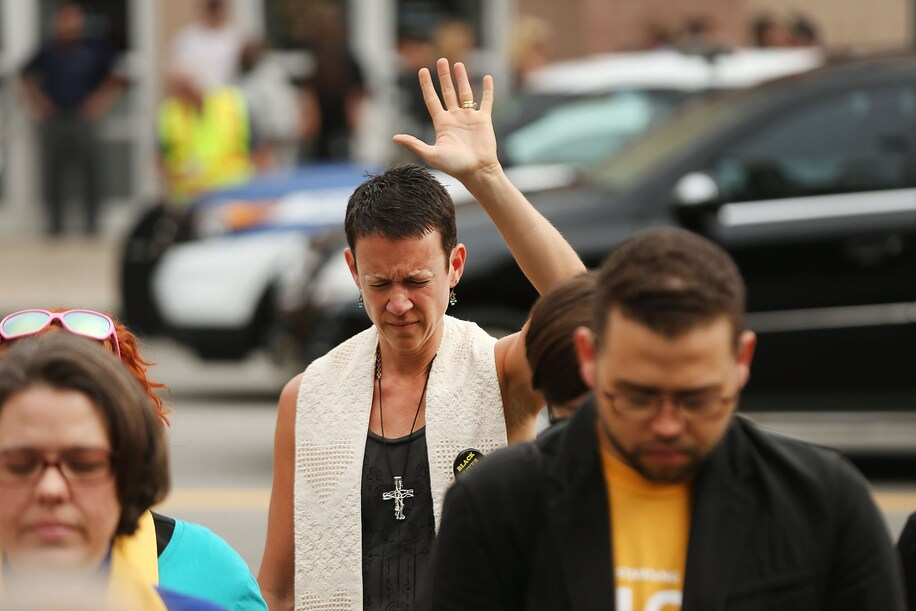
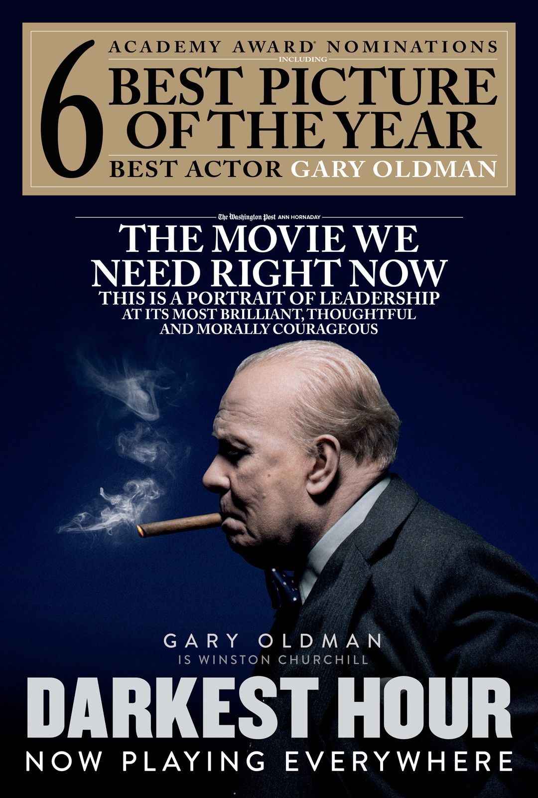

# <!--fit--> Living out the Gospel 

Self-giving Love the Book of Philippians - Chapter 5

Timothy Shan

---

# My trip to Boston 

- August, 2017, I was on a trip to `Boston`, there is a nice youth hotel beside the Boston Commons park 
- However, there would be a `right-wing protest` near the park based on the news, so I did not book that youth hotel 

--- 

# <!--fit--> Who are the protesters?

--- 

# What actually happend 

- `40,000` counterprotesters outnumbered the white-supremacists in the middle 

--- 

# What actually happend 

---

# Theology vs Ethics 

- From the book: 

> Paul surely would scratch his head at that practice of many Christian seminaries and universities to separate the study of `right thinking` (theology) from `right living` (ethics) into separate courses, or even separate departmentments.

---

# Theology vs Ethics 

- The gospel that saves us must take on blood and bones in the lives of God's people, or it morphs into something other than the gospel 

- On May 10, 1940, Winston Churchill became Prime Minister. When he met his Cabinet on May 13 he told them that 

> I have nothing to offer but blood, toil, tears and sweat.

---

# Darkest Hour 

- IMDB 7.4, Rotten Tomatoes 84%
- *please turn on the audio sharing*

---